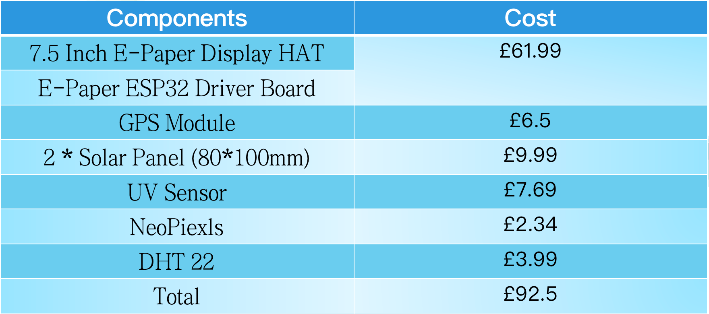
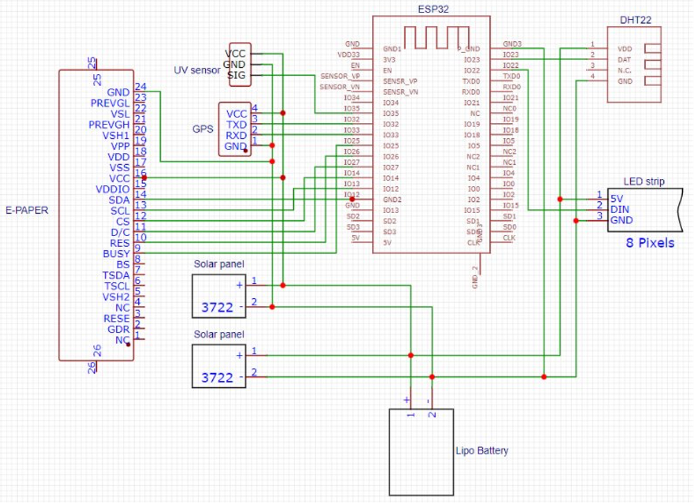
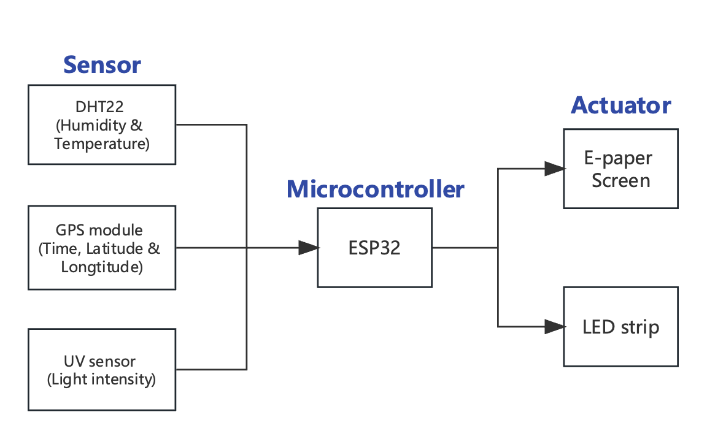

<h1>smart picnic basket</h1>  
  

Figure 1. smart picnic basket  

**What the project does:**

Our team has designed and developed a smart picnic basket integrated with advanced technology. This basket has multiple sensors that monitor the surrounding environment, providing real-time information on UV intensity, temperature, and humidity to ensure users’ safety and comfort. With this real-time data, users can make better decisions, such as applying more sunscreen or finding a shady spot to avoid the heat.  
Our smart picnic basket also includes a built-in GPS feature and displays location information on an E-paper screen. This not only allows users to know their exact location easily but, with potential future enhancements, the GPS tracking could also mean that no matter where the basket is placed, it can easily be found, reducing the risk of loss.  
This smart picnic basket aims to resolve common issues encountered during traditional picnics, making picnicking more convenient, safe, and enjoyable. We believe that through the power of
technology, we can enhance people’s outdoor experiences, allowing everyone to enjoy nature while benefiting from the conveniences of smart technology.  

**Why the project is useful:**

For family user: Our picnic basket is perfect for families to use for outdoor activities. They can put fruits, snacks, drinks, and whatever they want inside. They can also share geographic location information(longitude and latitude) with their friends if they agree to meet at a certain location in the park. People know they need to wear thick clothes when they see the temperature on the E-paper screen go down to avoid getting cold. If the humidity index is over 70 percent, it may rain soon. Thus, users could leave the picnic place to find shelter to avoid being wet if the humidity approximates 70 percent.  
For technology enthusiasts: An E-paper screen is positioned on the front of the smart picnic basket, displaying real-time environmental data, making the basket more technological. Two solar panels are placed on the top that can charge the rechargeable lithium battery to power the entire circuit.  
For outdoor enthusiasts: A UV sensor and an LED stick are on the basket’s front. The LED stick displays the intensity of ultraviolet light; when the lights on the LED stick are more than 4 pixels, it means sunshine may harm people’s skin, so we recommend users apply some sunscreen. Moreover, some tips for coping with emergencies in the wild are also provided on the E-paper screen, such as how to identify poisonous mushrooms and proper medication to deal with emergencies.  

**How users can get started with the project:**

1.For users  
Users can pack the food and water needed for the picnic into the smart picnic basket before departing. The E-paper screen of the basket will display the temperature, humidity, time, and latitude and longitude of the current environment. Users can share the latitude and longitude of the picnic location with their friends for a good meeting. The screen will display some outdoor activity tips, and the NeoPixel next to the screen will display UV index. Users can apply some sunscreen if the UV index is too high. In the presence of sunlight, the two solar panels at the top of the basket can charge the built-in lithium battery, allowing the entire circuit to operate normally.  
2.For project builders  
If you want to reproduce our product easily, all the required source files have been uploaded to the GitHub repository. Firstly, you can purchase all the hardware required to reproduce this project through online shopping platforms such as Amazon.  

Figure 2. Components and costs  
Secondly, you can download the Picnic Basket-laser cut.dxf file under the design folder, which contains all the components of the basket laser cutting. You can use a 3mm pine board to make the frame of the basket. Back Frame.gcode and Front Frame.gcode are the frames before and after the E-paper screen used in the basket. You can use these two frames for 3D printing to protect the E-paper screen. All files for PCB design are placed in the PCB folder, and you can choose to use either PCB or ESP32, both of which are feasible.
Next, connect all the hardware and circuits. You can refer to our circuit schematic and workflow diagram. The code required for circuit operation is placed in the GPP folder with the file name GPP.ion.  

Figure 3. Circuit schematic  

Figure 4. Workflow  
After completing the steps of material preparation, laser cutting, 3D printing, and circuit connection, the final step is to assemble the basket. You can purchase a super glue for the bonding of the basket after assembly, which has been tested by us and is very useful. You can choose a beautiful piece of fabric to place inside the basket and use a watercolor pen to color the outside of the basket. This will complete the production of a beautiful and practical smart picnic basket.  

**Where users can get help with your project:**

We are master's students majoring in Connected Environment at UCL School of the Bartlett for 23-24 academic years. If you encounter any problems during the process of regenerating our project, please feel free to contact us via the email below. We are willing to provide you with assistance.  

E-mail address: xueli.jiao.23@ucl.ac.uk 
             zhenkun.wang.23@ucl.ac.uk 
             haoming.wang.22@ucl.ac.uk 

**Who maintains and contributes to the project?**

Group leader: Xueli Jiao (Shelly)  
She is the leader of our team, organizing various group meetings to coordinate various aspects of the project, and is mainly responsible for the sensor parts.  

Electronic engineer: Zhenkun Wang (Harry)  
He is the engineer in our team and accounts for the E-paper screen and connects each hardware to the whole circuit, in addition, he designs PCB for the product.  

Designer: Haoming Wang (Axe)  
He is the designer in our team, working include design the prototype of the basket and also the 3D model of job-related things. Besides, he write the script for the 3-minute video.  
